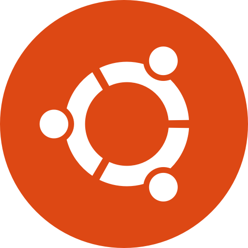

<h1 align="center">Welcome to YALab Dev</h1>

<h2 align="center">About Us</h2>
This account serves the devops team of <a href="https://yanivassaflab.com/">prof. Yaniv Assaf's Lab</a>, dedicated to develop next-gen MRI tools to unlock brain plasticity.

<h2 align="center">Projects</h2>

- **[yalab_executions](https://github.com/yalab-dev/yalab_executions):** Repository for managing MRI data processing procedures.
- **[yalab_runner](https://github.com/yalab-dev/yalab_runner):** Framework for executing procedures.
- **[yalab_participants](https://github.com/yalab-dev/yalab_participants):** Managing and logging participant data.

<h3 align="center">Languages and Tools:</h3>

 
 
 
 
 

<h3 align="center">Contact us:</h3>

 
 

